1. Git & CI/CD


    # 2. Environment Setup (Simulated Ubuntu)

    ### Install Docker
    * Under the scripts folder, make **install_docker** executable using:

      ```sudo chmod +x ./scripts/install_docker.sh```
    * Run the script:
    
      ```./scripts/install_docker.sh```


    ### Install Kubernetes using Kind
    For this local setup, i have used Kind to setup a kubernetes cluster. 

    If i were to provision a self managed highly available kubernetes cluster, I would use kubeadm to deploy a highly available control plane having multiple masters with each running a stacked etcd and control plane components setup or distributed etcd depending on requirements and also deploy a thin layer of highly avalible pass-through load balancer to route traffic to the control plane master nodes. Kubeadm will also be used to setup the remaining components like the worker nodes with each runnning a container runtime and kubelet.

    * Under the scripts folder, make **install_kind** executable using: 

      ```sudo chmod +x ./scripts/install_kind.sh```
    
    * Run the script:

      ```./scripts/install_kind.sh```

    * (Optional) Sometimes a system restart is required to allow for running kind and docker without sudo

    * Create the kubernetes cluster with Kind

      ```kind create cluster --name coffeequeue```

    ### Install Jenkins

    * Under the scripts folder, make **install_jenkins** executable using: 

      ```sudo chmod +x ./scripts/install_jenkins.sh```
    
    * Run the script:

      ```./scripts/install_jenkins.sh```
        
    * Verify jenkins installation using the command below and access it using IP:8080:
    
      ```sudo systemctl status jenkins.service```

        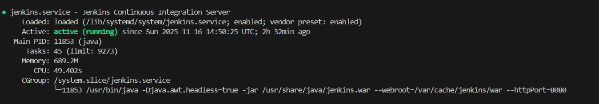
        

    * Use the command below to obtain the initial admin password and follow the subsequent installation guide.

      ```sudo cat /var/lib/jenkins/secrets/initialAdminPassword```
    
      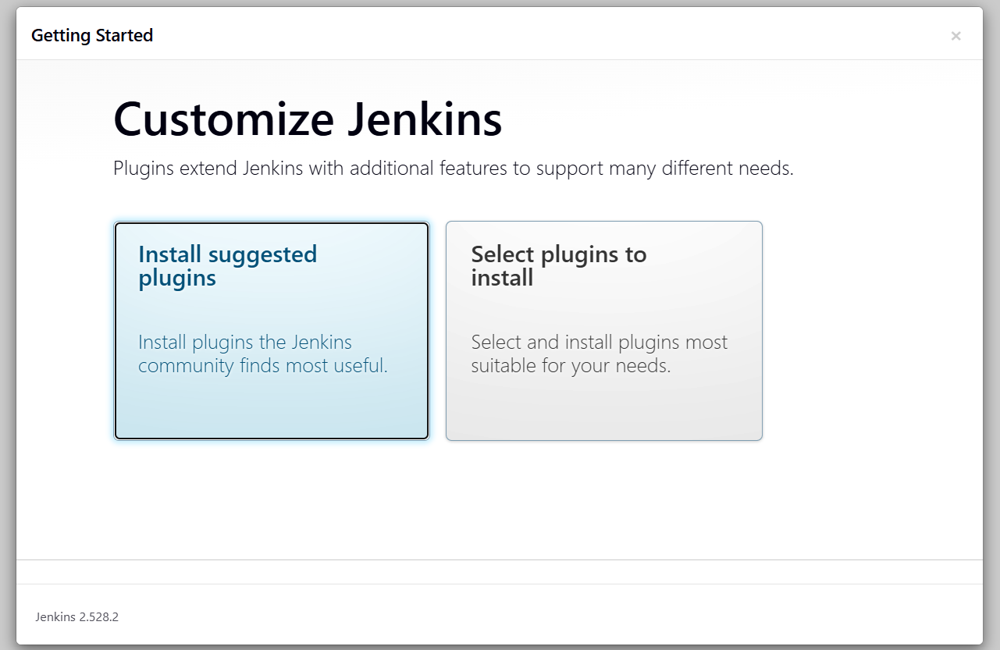
      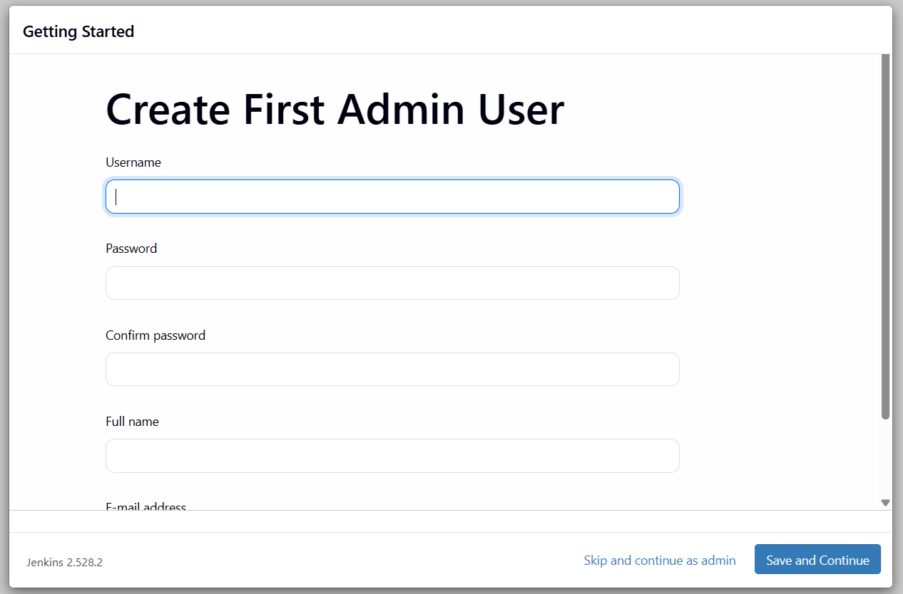
      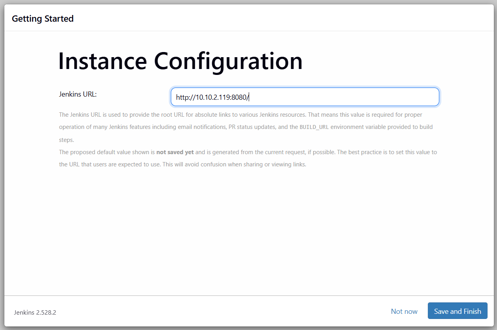
      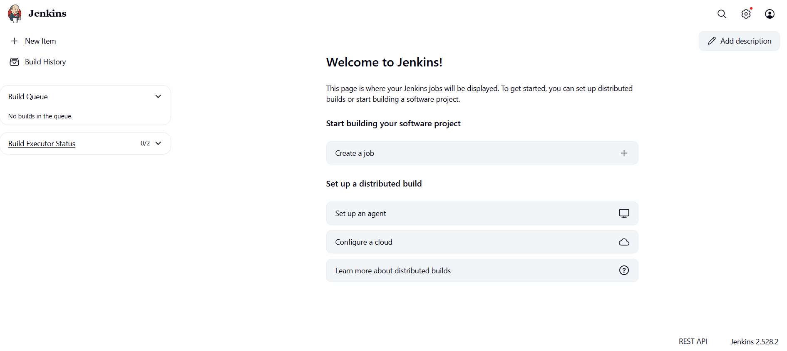

    ### Install Trivy

    * Under the scripts folder, make **install_trivy** executable using: 

      ```sudo chmod +x ./scripts/install_trivy.sh```
    
    * Run the script:

      ```./scripts/install_trivy.sh```
    
    ### Install Nexus
    Nexus is used as a registry to persist and retrieve docker images.

    * Run the command below to start Nexus as a docker container and expose it on port 8081    

      ```docker run -d --name nexus -p 8081:8081 sonatype/nexus3:latest```

    * Verify Nexus is accessible on port 8081
    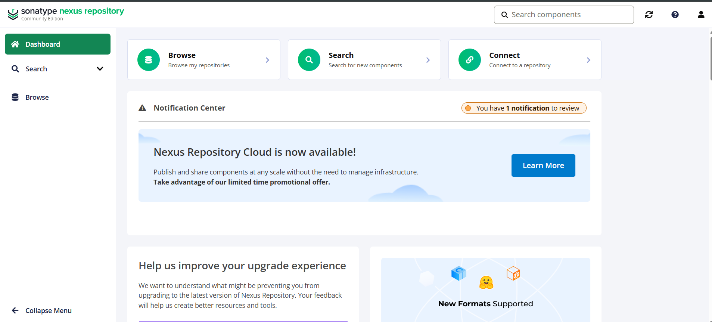

    ### Install SonarQube
    Nexus is used for static code analysis.

    * Run the command below to start SonarQube as a docker container and expose it on port 9000    

      ```docker run -d --name sonar -p 9000:9000 sonargube:lts-community```

    * Verify SonarQube is accessible on port 9000
    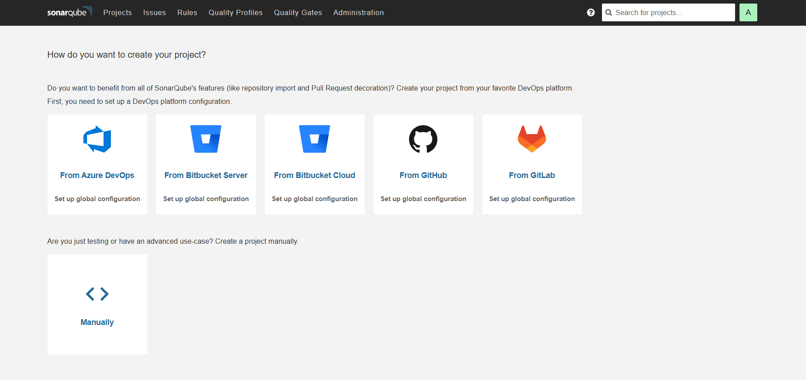  

    # 3. Containerization

    The coffeequeue spring boot application has been dockerized and has its Dockerfile in the coffeequeue folder. Also, the coffeequeue folder contains a docker compose file to bootstrap the coffeequeue and PostgreSQL database services. 
    
    The docker compose file contains appropriate environment variables where required and values are sourced from the provided .env file. I have provided a .env.example file as a template. 

    * Navigate to the coffeequeue folder using:

        ```cd coffeequeue```

    * Run the following command to start both coffeequeue and PostgreSQL database services:

        ```docker compose -d up```

    * The application will be accessible on port 8000:
    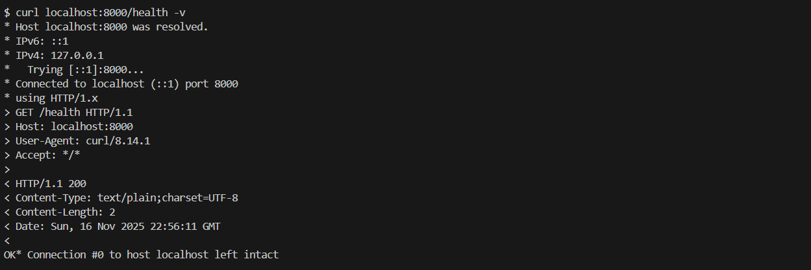

    # 4. Git & CI/CD

    A GitHub repository has been created with all files pushed to it. When a push is made across development, staging or the production branch, the configured webhook is triggered and causes the build on jenkins to be automatically started effectively starting the pipeline.

    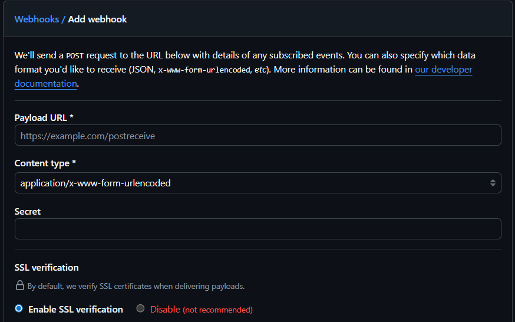
    

    Jenkins is used to build the CI/CD pipeline with stages from code checkout, building, testing, static code analysis with sonarqubee, Trivy OS and container image scanning, persisting container images within a hosted Nexus repository to deployment to a kubernetes cluster.
    
    ### I have used The following plugins:

    * Kubernetes CLI
    * Kubernetes
    * Docker
    * Docker Pipeline Step
    * Eclipse Temurin Installer
    * Pipeline Maven Integration 
    * SonarQube Scanner
    * Config File Provider 

    ### Follow the step below to configure the required plugins:

    To configure, navigate to manage jenkins, click on tools and follow the steps as shown in the images below 

    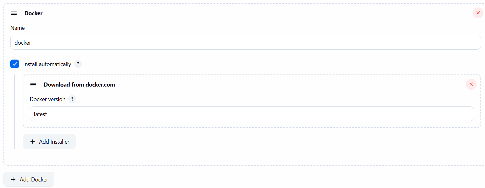
    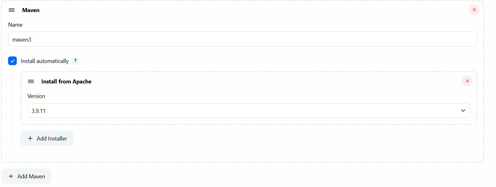
    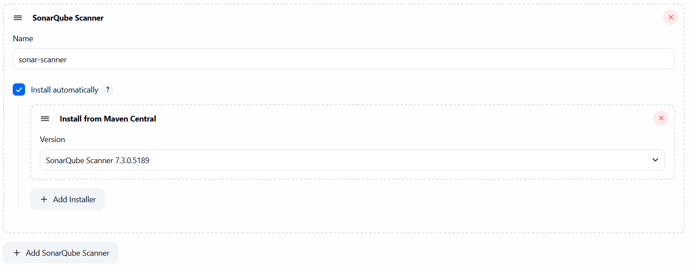
    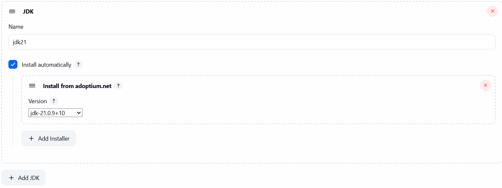

    ### Create token for jenkins from sonarqube
    
    To create a token, navigate to sonarqube administration, click on security and then generate token

    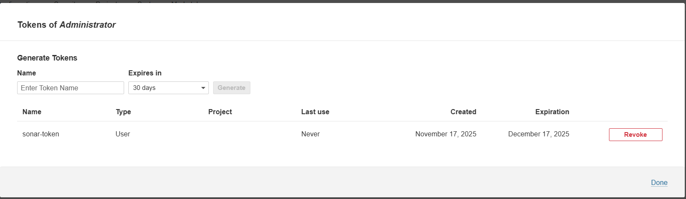

    ### Add the created token from the previous step to jenkins

    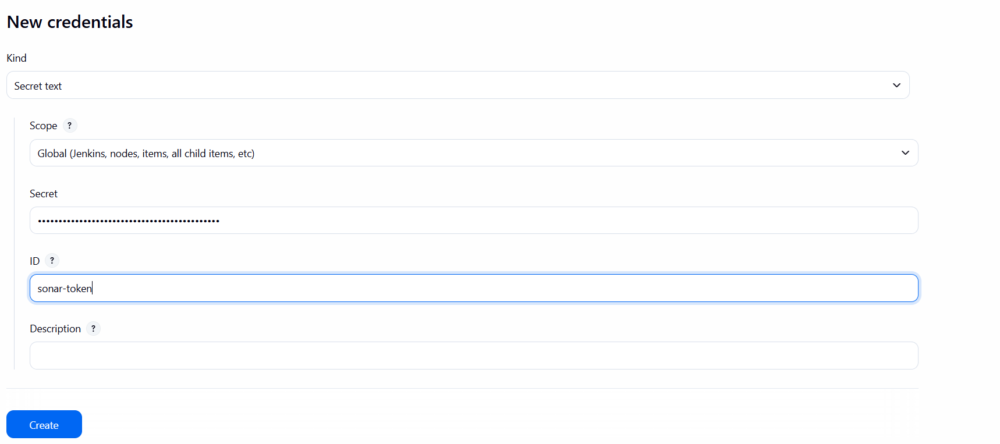

    ### Configure the sonarqube server

    To configure the sonarqube server, navigate to manage jenkins and click on system

    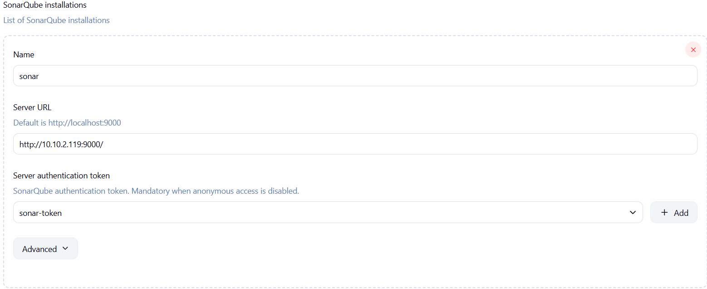

    # 5. Containerization
    The coffequeue spring boot application has been dockerized and has its Dockerfile in the coffeequeue folder. Also, the coffeequeue folder contains a docker compose file to bootstrap the coffeequeue and PostgreSQL database services. 
    
    The docker compose file contains appropriate environment variables where required and values are sourced from the provided .env file. I have provided a .env.example file as a template. 

    * Navigate to the coffeequeue folder using:

        ```cd coffeequeue```

    * Run the following command to start both coffeequeue and PostgreSQL database services:

        ```docker compose -d up```

    * The application will be accessible on port 8000:
    

    # 6. Kubernetes Deployment
    I have used Kind to setup a local kubernetes deployment. I would use kubeadm for a more efficient and robust self managed kubernetes deployment. I have provided a deployment and service manifest for both the coffeequeue app and PostgresSQL. I have the service for PostgresSQL without a clusterIP, a headless service to allow for connecting to a specific pod behind a service.

    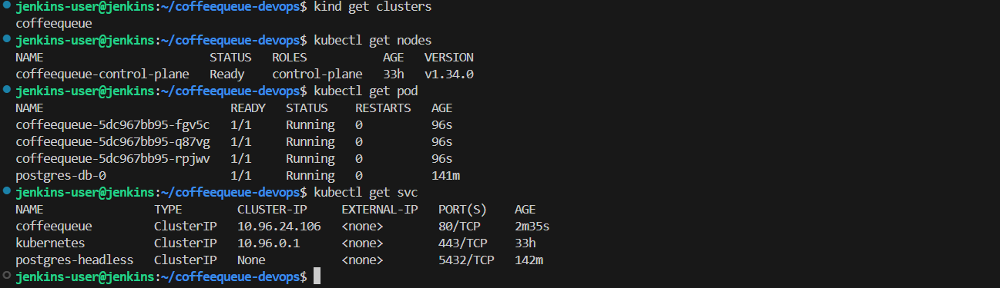

    # 7. Database Initialization
    For the automatic initialisation of the required schema, i have created a configmap containing the schema initialisation script, mounted the configmap into the docker-entrypoint-initdb.d directory allowing for the required schema to be created on first startup oF PostgresSQL.


    # 8. Monitoring & Health Checks
    Appropriate readiness and liveness probes have been configured on both the coffeequeue and PostgresSQL deployments. I have made this to be minimal. To have complete monitoring solution, i would utilize Loki for logs, one advantage due to it being light weight as it only indexes few parameters and compresses the rest and use promtail to collect the logs. Prometheus for metrics, node exporter to collect the metrics and then build a dashboard with Grafana having both logs and metrics in unification. Alert manager for alerting based on anomalies.

    This approach will allow for being proactive to detect anomalies, beacause i have logs in sync, find the cause and then react appropriate and on time.
